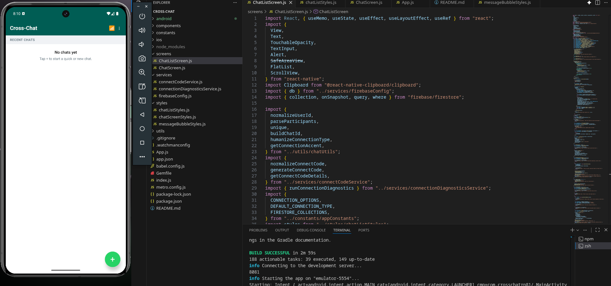

# Cross-Chat

React Native chat app with Firebase, connect codes, and WhatsApp-style UI.



## Features

- Group chat (2+ participants)
- Recent chats with unread badge
- Connect by unique code
- Connection mode per chat (`Internet`, `Wi-Fi`, `Bluetooth` UI mode)
- Connection diagnostics test
- Read receipts and date separators in messages

## Project structure

- `screens/` → screen components
- `components/` → reusable UI blocks
- `styles/` → separated styles
- `utils/` → pure helper utilities
- `constants/` → app constants
- `services/` → Firebase + feature services
- `android/`, `ios/` → native React Native projects

## Prerequisites

- Node.js 20+
- JDK 17+
- Android Studio (SDK + emulator)
- (macOS only) Xcode for iOS simulator

## Setup

1. Install dependencies:

```bash
npm install
```

2. Add your Firebase config in `services/firebaseConfig.js`.

3. Start Metro:

```bash
npm start
```

## Run locally (normal native way)

### Android emulator

```bash
npm run android
```

### iOS simulator (macOS)

```bash
npm run ios
```

## Firebase notes

- Enable Firestore in your Firebase project.
- For development, use test rules only temporarily.
- Tighten Firestore rules before production.

## Troubleshooting

- If Metro cache is stale:

```bash
npx react-native start --reset-cache
```

- If Android build fails, open Android Studio once and verify SDK path/emulator.
- If Gradle fails after dependency changes, clean build:

```bash
cd android && ./gradlew clean
```
